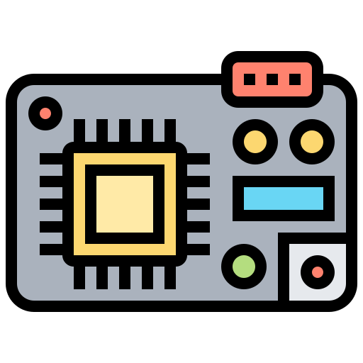

# Microcontroladores  

En este espacio encontrarán trabajos, ejercicios y repositorios realizados durante el VI semestre 2025A.

## I Corte
### Grabación Ejercicio Uno
Puedes ver la grabación de ejemplo uno en el siguiente enlace:

### Grabación Ejercicio Uno

[Descargar Grabación Ejercicio Uno](https://github.com/JerssonF/MICROCONTROLADORES/raw/main/Videos/Grabación%20Ejercicio%20Uno%202025-02-06%202021.mp4)

### Grabación Ejercicio Dos

[Descargar Grabación Ejercicio Dos](https://github.com/JerssonF/MICROCONTROLADORES/raw/main/Videos/Grabación%20Ejercicio%20Dos%202025-02-13%202021.mp4)

### Grabación Ejercicio Tres

[Descargar Grabación Ejercicio Tres](https://github.com/JerssonF/MICROCONTROLADORES/raw/main/Videos/Grabación%20Ejercicio%20Tres%202025-02-20%202021.mp4)

